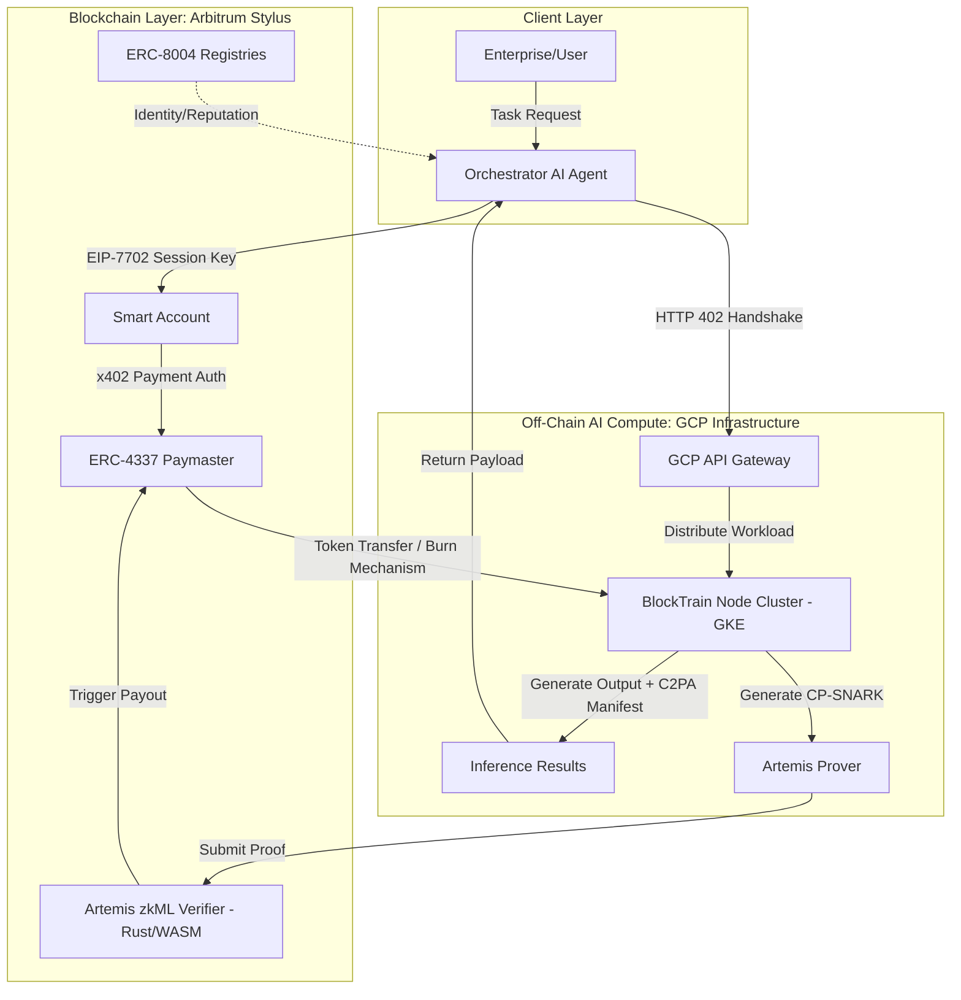

# Architecture Blueprint

## System Overview
The Web3 AI Agent Economy architecture is highly decoupled, isolating computationally heavy machine learning workloads on off-chain infrastructure (GCP) from identity, verification, and settlement mechanisms hosted on the blockchain (Arbitrum Stylus).

## The Three Pillars

### 1. Off-Chain Inference Engine (GCP & BlockTrain)
- **Framework:** PyTorch/Hugging Face running on a decentralized topology of GCP GKE nodes (funded by Google Cloud Web3 Startups program).
- **Optimization Strategy:** We utilize AWQ and GGUF 4-bit/8-bit quantization on GCP L4 nodes to maximize memory bandwidth and ensure our Artemis CP-SNARK prover achieves sub-2.5 second latency.
- **Model Target:** Highly distributed serving of 8B parameter models (e.g., Llama-3-8B-Instruct, Mistral-7B).
- **Mechanism:** Implements "Spheroid BlockTrain", splitting models into independently trainable blocks using block-local diffusion objectives. 

### 2. On-Chain Verification & Settlement (Arbitrum Stylus)
- **Framework:** Rust (WASM), Solidity, Foundry.
- **Mechanism:** Uses Artemis Commit-and-Prove SNARKs (CP-SNARKs). 
  - **Schwartz-Zippel Lemma:** The protocol verifies commitments outside the SNARK without leaking the underlying polynomial, drastically reducing computational complexity.
  - **Aggregation:** Reduces the overhead for checking millions of parameters from 11.5x down to 1.2x.
  - **Arbitrum Stylus:** The verifier is written in `#[no_std]` Rust and compiled to WASM. It utilizes Montgomery Multiplication for modular arithmetic to bypass EVM gas limits, measuring costs in highly efficient "ink" rather than traditional EVM gas.

### 3. Agentic Networking & Payments (x402 & EIP-7702)
- **Framework:** HTTP, ERC-4337 Paymasters, EIP-7702, `eth_account`.
- **Mechanism:** 
  - When Agent A requests data from Agent B, Agent B responds with HTTP 402 and an x402 authorization payload. 
  - Agent A uses its EIP-7702 delegated smart account session key (Transaction type 0x04) to sign a gasless batch transaction, governed strictly by an immutable `dailyAllowance` to prevent exploitation.
  - The payment flows through an ERC-4337 Arbitrum paymaster, automatically participating in the Burn-and-Mint Equilibrium (BME) tokenomics model (`BME.sol`) which mathematically enforces supply deflation.

### 4. Testing & Verification Methodology (TDD)
- **Framework:** `pytest` (Python), `forge test` (Foundry/Solidity), and `cargo test` (Rust).
- **Standard:** Code is strictly verified against mathematical models (e.g. strict +1/-5 reputation adjustments, explicit 100:95 deflation ratios). All failing verifications must cost 0 gas where possible.

### 5. Enterprise SaaS Bridge
- **Identity & Reputation:** Handled via `AgentIdentity.sol` (ERC-721) and `ReputationRegistry.sol`. Nodes possess immutable, verifiable track records.
- **Fiat Subscription:** Handled via `SubscriptionManager.sol`, bridging Web2 Enterprise logic to Web3 stablecoin rails for automated, trustless infrastructure provisioning. All Smart Contracts and Python state graphs must be accompanied by comprehensive unit tests asserting expected state transitions, negative cases (e.g., failed signatures), and simulated EIP-7702 delegations *before* execution logic is finalized. Code coverage must remain above 95%.

### 6. Legal Compliance Architecture (Phase 5)
- **Token Classification:** `UtilityToken.sol` is structurally shielded from securities laws (SEC Howey / SEBI) via strict utility consumption requirements and algorithmic BME governance, as formally outlined in `LEGAL_COMPLIANCE.md`.
- **Mainnet Bootstrapping:** `DeployMainnet.s.sol` guarantees a transparent, decentralized, and humanless initiation of the entire protocol.

## High-Level Diagram

