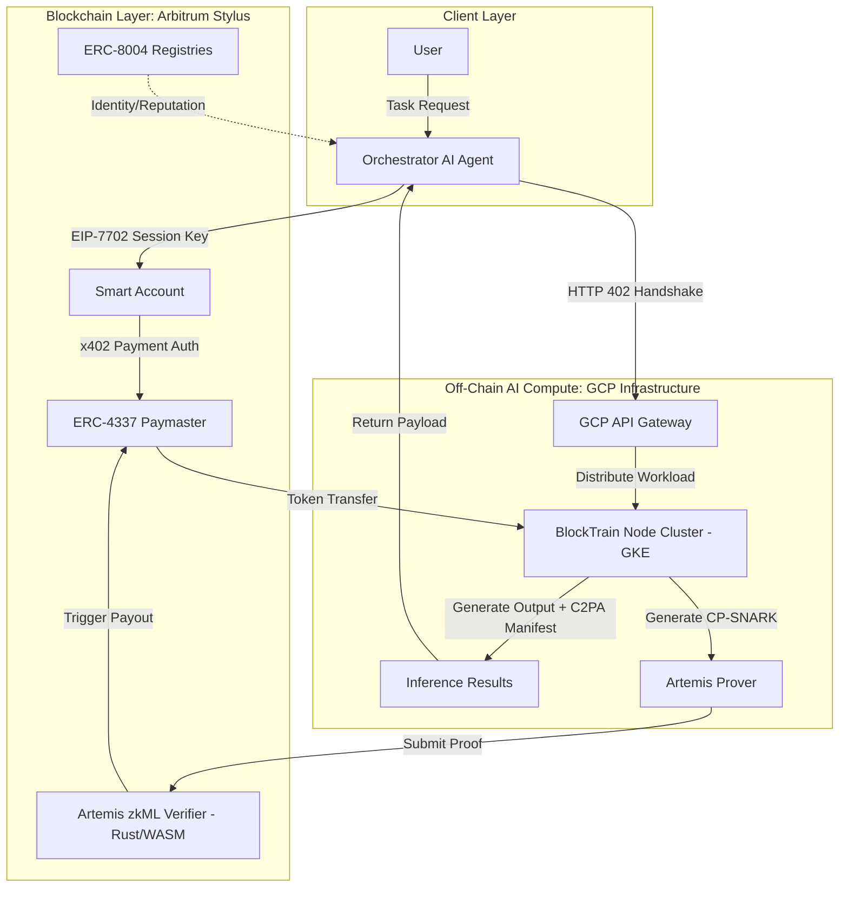

# Architecture Blueprint

## System Overview
The Web3 AI Agent Economy architecture is highly decoupled, isolating computationally heavy machine learning workloads on off-chain infrastructure (GCP) from identity, verification, and settlement mechanisms hosted on the blockchain (Arbitrum Stylus).

## The Three Pillars

### 1. Off-Chain Inference Engine (GCP & BlockTrain)
- **Framework:** PyTorch, Hugging Face, LangChain, LangGraph.
- **Hardware:** GCP Kubernetes Engine (GKE) running L4/H100 instances.
- **Mechanism:** Implements "Spheroid BlockTrain", splitting models into independently trainable blocks using block-local diffusion objectives, allowing for highly distributed, wide-area network serving of 70B+ parameter models.

### 2. On-Chain Verification & Settlement (Arbitrum Stylus)
- **Framework:** Rust (WASM), Solidity, Foundry.
- **Mechanism:** Uses Artemis Commit-and-Prove SNARKs (CP-SNARKs). The GCP nodes generate a proof of inference and submit it to the Rust-based Arbitrum Stylus contract. This reduces commitment check overhead from 11.5x to 1.2x.

### 3. Agentic Networking & Payments (x402 & EIP-7702)
- **Framework:** HTTP, ERC-4337 Paymasters, EIP-7702.
- **Mechanism:** When Agent A requests data from Agent B, Agent B responds with HTTP 402 and an x402 authorization payload. Agent A uses its EIP-7702 delegated smart account session key to sign a gasless transaction, paying Agent B in USDC instantly via an Arbitrum paymaster.

## High-Level Diagram

